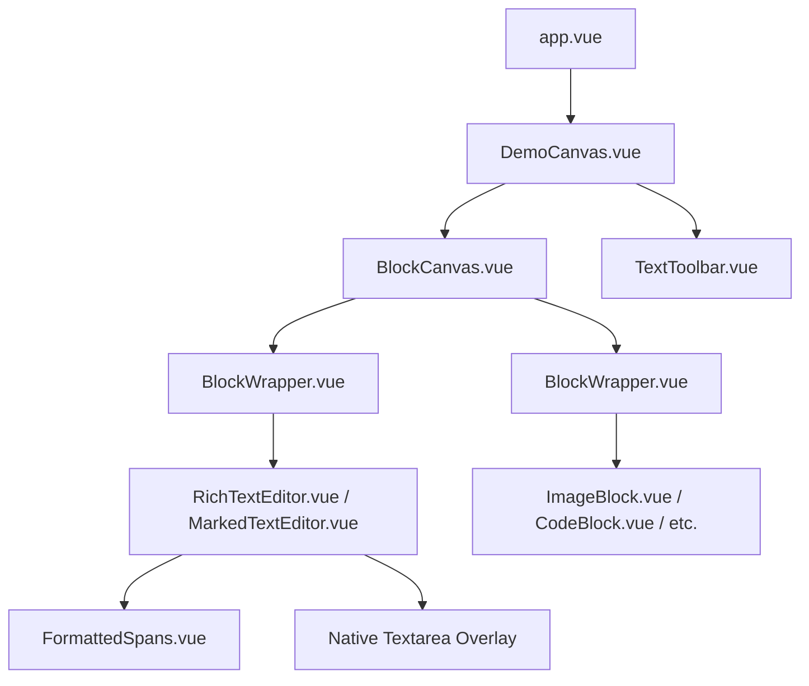

# Blocks Architecture & Developer Guide for AI Agents

This guide is the single source of truth for developing, maintaining, and extending the **Blocks** application. Every AI agent working on this codebase must follow the architectural patterns, contracts, and invariants detailed below.

---

## 1. Project Overview & Tech Stack

- **Framework**: Nuxt 4 (Vue 3, `<script setup lang="ts">`, Composition API).
- **Styling**: Tailwind CSS v4 (`@tailwindcss/vite`, `@reference "tailwindcss"`).
- **State Management**: Pinia (`useTypingStore` for active text formatting & selection, `useBlocksStore` for page-level state).
- **Code Editor**: Monaco Editor via `@monaco-editor/loader`, JetBrains Fleet dark theme, Vite worker plugins (`app/plugins/monaco.client.ts`).
- **Math Rendering**: KaTeX (`katex` + `katex/dist/katex.min.css`) used for `MathBlock` and inline math spans.
- **Icons**: Nuxt Icon (`@nuxt/icon` with `@iconify-json/material-symbols`).
- **Testing & Quality**: Playwright (`tests/blocks.spec.ts`), Vue TSC (`npx nuxi typecheck`).

---

## 2. Core Domain Model & Polymorphic Contracts

### 2.1 The `Block` Base Class
Located at `app/core/blocks/Block.ts`. Every block in the application inherits from this base class:
- **Properties**:
  - `id: string`: Unique block identifier (UUID or stable key).
  - `version: number`: Version counter for optimistic updates / history.
  - `data: string | null`: Raw textual payload (e.g. paragraph text, markdown marker text, image URL/base64, code snippet, LaTeX formula).
  - `blockType: BlockType | null`: One of the 14 recognized block types.
  - `blockSettings: IBlockSettings`: Concrete settings instance implementing `IBlockSettings`.
- **Abstract / Polymorphic Methods**:
  - `abstract toMarkdown(): string`: Serializes block state to Markdown representation.
  - `abstract fromMarkdown(markdown: string): Block`: Deserializes Markdown into a concrete block instance.
- **Immutable Updates**:
  - `withData(data: string | null): this`: Returns a new block instance preserving id, version, type, and settings.
  - `withSettings(settings: any): this`: Returns a new block instance preserving id, version, type, and data.
- **Serialization**:
  - `toJSON()`: Emits a plain JSON-serializable snapshot.
  - `Block.fromJSON(json)`: Re-instantiates the correct concrete `Block` subclass and concrete `IBlockSettings` class via `registry.ts`.
  - Nuxt hydration preserves concrete class instances via `app/plugins/block-payload.ts`.

### 2.2 The 15 Block Subclasses & Concrete Settings
Each block type has its own concrete class extending `Block` (`app/core/blocks/blockClasses.ts`) and its own concrete settings class implementing `IBlockSettings` directly:

| Block Type | Block Class | Settings Class | Stored `data` Format |
|---|---|---|---|
| `paragraph` | `ParagraphBlock` | `ParagraphBlockSettings` | Raw plain text |
| `heading1` | `Heading1Block` | `Heading1BlockSettings` | Heading level 1 text |
| `heading2` | `Heading2Block` | `Heading2BlockSettings` | Heading level 2 text |
| `heading3` | `Heading3Block` | `Heading3BlockSettings` | Heading level 3 text |
| `divider` | `DividerBlock` | `DividerBlockSettings` | Fixed as `---` |
| `bulletedList`| `BulletedListBlock`| `BulletedListBlockSettings` | Markdown lines: `- item` |
| `numberedList`| `NumberedListBlock`| `NumberedListBlockSettings` | Markdown lines: `1. item` |
| `quote` | `QuoteBlock` | `QuoteBlockSettings` | Markdown lines: `> item` |
| `link` | `LinkBlock` | `LinkBlockSettings` | Plain URL |
| `image` | `ImageBlock` | `ImageBlockSettings` | URL or base64 data string |
| `video` | `VideoBlock` | `VideoBlockSettings` | URL or base64 data string |
| `audio` | `AudioBlock` | `AudioBlockSettings` | URL or base64 data string |
| `code` | `CodeBlock` | `CodeBlockSettings` | Source code string |
| `math` | `MathBlock` | `MathBlockSettings` | LaTeX string (e.g. `E = mc^2`) |
| `drawing` | `DrawingBlock` | `DrawingBlockSettings` | JSON string: `{"strokes":[...]}` |

> [!IMPORTANT]
> **No Shared Settings Base Class**: Do NOT create a shared base class for settings. Each settings class must directly implement `IBlockSettings`.
> All block modifications must return a new instance via `.withData(...)` or `.withSettings(...)`. Never mutate blocks in place.

---

## 3. Rich Text Formatting & Span Architecture

Located in `app/core/blocks/textSpans.ts`. Text blocks (`paragraph`, `heading1`, `heading2`, `heading3`, `bulletedList`, `numberedList`, `quote`) support inline formatting and text coloring via compact range-based spans.

### 3.1 Data Structures
```ts
export interface StyleSpan {
  start: number; // 0-based character index (inclusive)
  end: number;   // 0-based character index (exclusive)
  style: string; // "normal", "bold", "italic", "underline", "strikethrough", "code", "math"
}

export interface ColorSpan {
  start: number; // 0-based character index (inclusive)
  end: number;   // 0-based character index (exclusive)
  color: string; // CSS color string (e.g. "#2563eb")
}
```

### 3.2 Pure Functions (`app/core/blocks/textSpans.ts`)
- `normalizeStyleSpans(spans, textLength)`: Clamps ranges, sorts, merges contiguous identical styles, fills gaps with `"normal"`.
- `normalizeColorSpans(spans, textLength)`: Clamps, sorts, and merges adjacent color ranges.
- `applyStyleToRange(spans, textLength, start, end, targetStyle)`: Toggles or adds a style flag across `[start, end)`.
- `applyColorToRange(spans, textLength, start, end, color)`: Sets character colors across `[start, end)`.
- `reconcileSpansOnTextChange(oldText, newText, styles, colors, activeStyle, activeColor)`: Reconciles spans after user typing/deleting text using prefix-suffix difference analysis and inherits active typing styles for newly inserted characters.
- `buildRenderSpans(text, styles, colors)`: Intersects style spans and color spans into disjoint `RenderSpan[]` for rendering.

### 3.3 Visual Layering & Dual-Layer WYSIWYG
- **Dual-Layer Architecture (`RichTextEditor.vue`)**:
  1. **Backdrop layer (`FormattedSpans.vue`)**: Positioned absolute behind the textarea (`pointer-events-none select-none`). Renders styled spans with `font-bold`, `italic`, `underline`, `line-through`, `font-mono bg-gray-100`, custom text color, or **KaTeX inline math** (`katex.renderToString(span.text)`).
  2. **Interactive layer (`<textarea>`)**: Transparent native textarea (`text-transparent caret-gray-900 selection:bg-blue-500/30`) on top. Handles native cursor navigation, keyboard shortcuts, IME, undo/redo, and text selection. When no formatting is active, falls back to `text-inherit`.

---

## 4. Component Hierarchy & Invariants



### 4.1 Component Contracts
1. **Block Props & Events**:
   - Every block component must accept `:block="block"` as an instance of `Block`.
   - Every editable component must emit `"update:block", [value: Block]`.
   - Never pass isolated primitive props (like `:text="string"` or `:id="string"`).

2. **`BlockWrapper.vue`**:
   - Must be transparent and borderless.
   - Root element must carry `tabindex="0"` and receive fallthrough `:data-block-id="block.id"`.
   - Left side: 4-dot actions menu trigger with delete button, alignment segmented control (left, center, right), and turn-into submenu with all 14 block types.
   - Right side: Icon identifying the block type (`blockIcons` mapping), revealed on hover or focus.
   - Deletes empty text blocks (`paragraph`, `heading1..3`, `bulletedList`, `numberedList`, `quote`) on two consecutive `Backspace` presses.

3. **`BlockCanvas.vue`**:
   - Manages block selection and custom mouse drag-selection rectangles.
   - Manages multi-block copy (`Ctrl+C`), paste (`Ctrl+V`), and delete (`Delete` / `Backspace`).
   - Emits `focused-block-type` and `focused-block` when focus enters an editable text block.
   - Handles `focusout` with a 250ms debounce and verifies `event.relatedTarget` and `document.activeElement` before emitting `null`.
   - Clicking empty canvas background cleanly dismisses the toolbar and deselects.

4. **`TextToolbar.vue`**:
   - Positioned fixed at bottom center of the editor (`z-50`).
   - Visible only when a text-editable block is focused.
   - **Button Layout**:
     - Left: Formatting buttons in order: **Bold** (`Ctrl+B`), **Italic** (`Ctrl+I`), **Underline** (`Ctrl+U`), **Strikethrough** (`Ctrl+Shift+X`), **Code** (`Ctrl+E`), **Math** (`Ctrl+M`, KaTeX inline math).
     - Divider: Vertical line.
     - Typography: Font family dropdown (`<select>`), Font size input (`<input type="number">`).
     - Right: Centered color picker with presets (Black, Blue, Red, Green), custom color button, and color picker trigger (`<input type="color">`).

---

## 5. Vector Ink Engine (`DrawingBlock`)

`DrawingBlock` represents the 15th polymorphic block subclass, implementing a vector drawing canvas with **Pen** and **Eraser** tools using PixiJS v8 (`pixi.js`).

### 5.1 Architecture & Invariants
- **Data Model**: Stored in `block.data` as JSON string:
  ```ts
  interface DrawingStroke {
    tool: "pen" | "eraser";
    points: Array<{ x: number; y: number }>;
    width: number;
    color?: string;
  }
  interface DrawingData {
    strokes: DrawingStroke[];
  }
  ```
- **Eraser as Ordered Operations**: Erasing is stored as ordered stroke operations (`tool: "eraser"`) rather than destructively deleting previous points. Pixi renders erasers with `blendMode = "erase"`, producing true transparent erasing on a transparent canvas (`backgroundAlpha: 0`).
- **Separation of Concerns**: Editor state (`activeTool`, `penColor`, `penWidth`, `eraserWidth`, `smoothing`) belongs to `DrawingToolbar.vue` and `DrawingBlock.vue`, never stored in block data.
- **Pure Geometry**: `app/core/blocks/drawingGeometry.ts`:
  - `resamplePoints(points, minDistance = 1.5)`: Filters redundant jitter during sampling.
  - `smoothPoints(points, smoothing = 0.5)`: Quadratic Bézier / midpoint curve smoothing executed on `pointerup`.
- **Performance Pipeline**:
  - `event.getCoalescedEvents()` for high-refresh stylus/touch events.
  - Local mutable point array during active draw (no Vue reactivity on hot path).
  - High-frequency visual feedback scheduled via `requestAnimationFrame`.
  - Commits immutable `.withData(...)` only on `pointerup`.

---

## 6. Focus & Toolbar Retention Invariants

> [!CAUTION]
> **Focus Invariant**: Clicking any control in `TextToolbar.vue` (Bold, Italic, Underline, Strikethrough, Code, Math, Color, Font family, Font size) **MUST NOT** cause the text block to lose focus or cause the toolbar to close.

### How Focus is Preserved:
1. **Preventing Focus Stealing on Click**:
   - All buttons in `TextToolbar.vue` have `@mousedown.prevent`.
   - The toolbar container has `@mousedown="onToolbarMouseDown"`, which calls `event.preventDefault()` unless the user is clicking on `<select>` or `<input>`.
2. **Synchronous and Asynchronous Re-Focus**:
   - `restoreBlockFocus()` finds the active block's `<textarea>` using `props.block?.id ?? typingStore.activeBlockId`.
   - It calls `textarea.focus()` and re-applies `textarea.setSelectionRange(start, end)`.
   - Called both immediately and inside `nextTick()` after formatting updates.
3. **Safe Blur Handling**:
   - `RichTextEditor.vue` (`onBlur`) and `MarkedTextEditor.vue` (`stopEditing`) check `event.relatedTarget?.closest('[role="toolbar"]')` and `document.activeElement?.closest('[role="toolbar"]')`.
   - They delay selection clearing by 250ms and cancel it if focus was retained or restored to the block.
   - `BlockCanvas.vue` (`onFocusOut`) checks `activeEl?.closest('[role="toolbar"]')` and delays toolbar dismissal by 250ms.

---

## 7. Development & Verification Workflow

1. **Static Analysis & Type Checking**:
   ```bash
   npx nuxi typecheck
   ```
   Must always pass with 0 errors before finishing any task.

2. **Testing**:
   - E2E tests are configured in `tests/blocks.spec.ts`.
   - Run tests with `npx playwright test`.
   - *Note*: If the user specifies not to run test suites during interactive prototyping, rely on `npx nuxi typecheck` and targeted scratch verification scripts.

3. **Adding a New Block Type**:
   1. Create settings class in `app/core/blocks/<Name>BlockSettings.ts` implementing `IBlockSettings`.
   2. Create block class in `app/core/blocks/<Name>Block.ts` extending `Block` with `toMarkdown()` and `fromMarkdown()`.
   3. Register the type in `app/core/blocks/registry.ts` and `app/core/blocks/settings.ts`.
   4. Create Vue component in `app/components/<Name>Block.vue` accepting `block: Block` and emitting `update:block`.
   5. Register component and icon in `BlockWrapper.vue` and `registry.ts`.
   6. Add unit/E2E coverage in `tests/blocks.spec.ts`.
